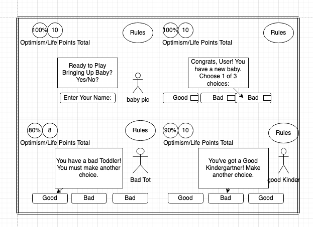

<h1>Surviving Baby
<h3>https://kelliematteson.github.io/project1/
<h1>Concept:
<h3>Description of the Game: Surviving Baby is a game of Chance. It's the user against the crazy baby. There are 3 rounds. In each round outcome cards are randomly shuffled and the user must select 3. Each time they experience a Parental WIN or a Baby ATTACK. They gain 2 mental health points or they lose 2 mental health points. By the end of 3 rounds, the User wins IF they have at least 5 mental health points left. The baby is now sleeping peacefully and the parents may consume all the wine they see fit. If the user ends the game with 4 or less mental health points, the baby has clearly won. The baby will be up all night while the parent lays in the hallway, unwashed and devastated.
<h1>Technologies Used:
<li><h4>html
<li><h4>css
<li><h4>javascript
<li><h4>jquery
<h5>credits
<h7>unsplash
<h7>freepik
<h1>Approach
<h3>Overview: I began sketching out my game and free thinking. Trying to imagine a game that I could translate to code, an idea I had never imagined before. Next, I drew up some wireframes and sketched out what I wanted the screen to look like at differnt points through out the game.
<h3>Wireframes
   
<h2>User Stories
<h3>As a User I expect to have a rules module pop up and let me know about the game. I want to see interesting cards to choose from and I'd like to see my score update in the top corner as I select different cards. As a user I want the cards to shuffle and give me fun options for each round.
<h3>Development Plan
<h4>I wanted to begin with free thinking and big ideas. The idea of creating a game is so exciting and I was coming up with tons of ideas. The next step was to pseudocode and try to break the game down into tiny bites and begin to match them with code. I needed to figure our how I would translate these english words into working code with working logic. The next step was to build, was a lot of trial and error. The final step would be testing it out on a friend, seeing if it hit the rounds I had set up.
<h3>MVP Deliverables

A two player game, the user against the computer. A class for the user and a way to instantiate them to begin the game. The game needed a way to win. My intention was to run the game for 3 rounds with the goal of collecting at least 5 or more Mental Health points. There was a way to lose, this would be by completing the 3 rounds but finishing the game with 4 or fewer points.
<h2>Challenges.

I was challenged at every single step. I spent too much time imagining grand games and fun ideas and not enough actually breaking down the game into very very simple steps. I had a difficult time knowing when to use jquery vs when to just use javascript. My code organization quickly became muddy and I grew frustrated as I couldn't figure out a simple fix and would unintentionally break a big part of my game, setting me way back. This has been a huge learning experience. I also restarted my game 3 separate times which I'm not sure I should have done but I definitely felt stuck, like I had gone too far in and couldn't see the forest through the trees. I absolutely want to seek help on this and keep working on it. 

